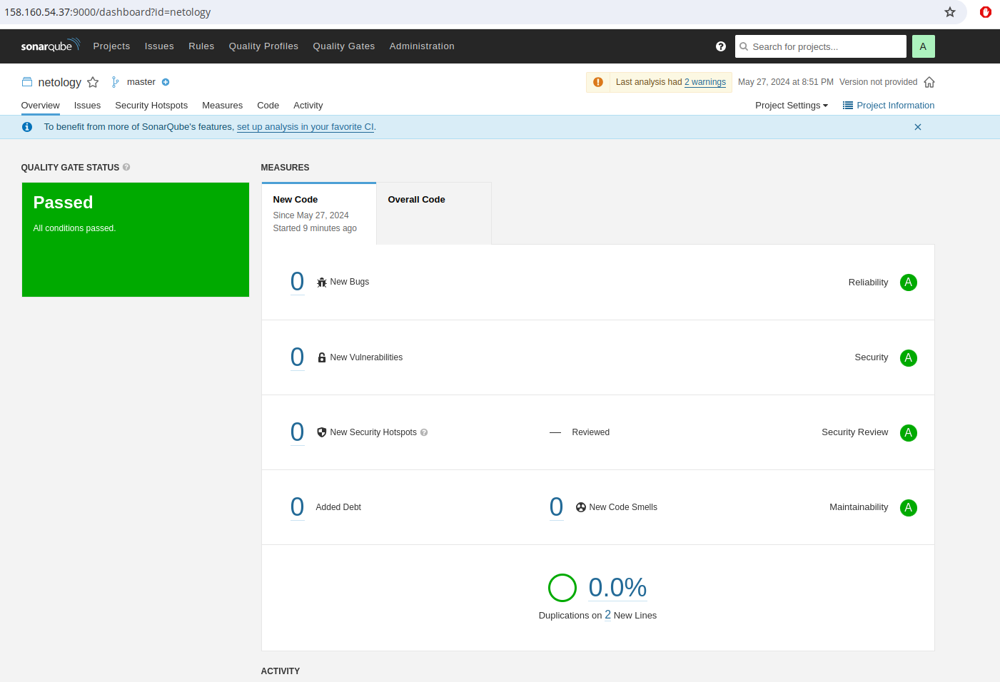

# Домашнее задание к занятию 9 «Процессы CI/CD»
---
### 1. SonarQube

Результат повторного анализа SonarQube после исправления багов в fail.py

---

### 2. Nexus

Файл [maven-metadata.xml](./maven-metadata.xml) для артефекта

---

### 3. Maven

Файл [pom.xml](./pom.xml) 

---

